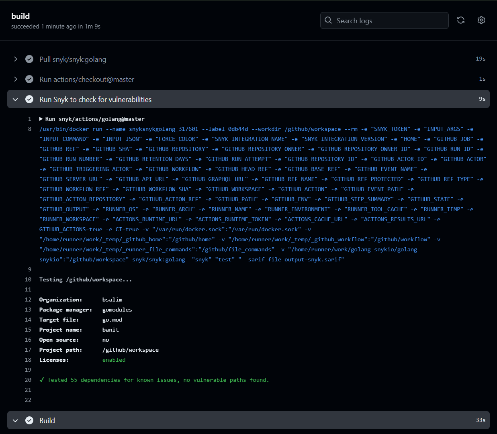

# RateGuard: A Go-based project for managing rate limiting and IP banning

## Overview

This project demonstrates how to implement an IP ban list in a web server using the Gin-Gonic framework in Go and using Snyk for Security checks. It includes middleware to check if an IP is banned and an endpoint to ban the IP, simulating a failed login attempt.




## Features

- Middleware to check if an IP is banned
- Endpoint to ban an IP
- Configurable ban duration

## Requirements

- Go 1.16 or later
- Gin-Gonic framework

## Installation

1. Clone the repository:

    ```sh
    git clone https://github.com/yourusername/ip-ban-list.git
    cd ip-ban-list
    ```

2. Install the necessary dependencies:

    ```sh
    go mod tidy
    ```

## Usage

1. Run the server:

    ```sh
    go run main.go
    ```

2. The server will start on `http://localhost:8080`.

3. To test the banning functionality, access the `/banit` endpoint from your browser or use `curl`:

    ```sh
    curl http://localhost:8080/banit
    ```

    This will ban your IP for the specified duration (default is 10 minutes).

4. If you try to access the `/banit` endpoint again during the ban period, you will receive a `403 Forbidden` response.

This project is to show example of GIN rate-limiting with Snyk integration.

